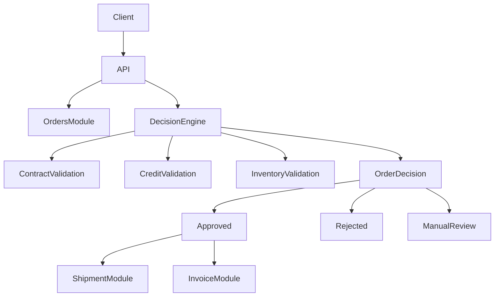

## Documentation

Detailed documentation can be found in the **docs** folder:

- Architecture overview → docs/architecture.md
- Domain model → docs/domain-model.md
- Order decision engine → docs/decision-engine.md


# B2B Order Processing System

## Overview

The **B2B Order Processing System** simulates an enterprise backend platform used by companies to process and manage large purchase orders between businesses.

The project demonstrates how complex business domains can be modeled and implemented using modern backend architecture principles such as:

* Domain-Driven Design (DDD)
* Clean Architecture
* Modular Monolith Architecture
* Event-Driven Design

The main goal of the project is to demonstrate how business decisions and validations in B2B environments can be automated through a well-structured backend system.

---

# Business Problem

In B2B environments, purchase orders usually require multiple validation steps before they can be accepted and processed.

Typical validations include:

* Contract verification
* Credit limit validation
* Inventory availability
* Approval workflows for large orders

In many companies, these checks are still performed manually or across poorly integrated systems.

This project demonstrates how these processes can be automated using a domain-driven backend system capable of evaluating orders and making intelligent processing decisions.

---

# Domain Strategy

Following **Domain-Driven Design principles**, the system domain is divided into three types of subdomains.

## Core Subdomain

### Order Decision Engine

The **Order Decision Engine** represents the core business capability of the platform.

This engine evaluates incoming orders and determines how they should be processed.

Business rules applied by the engine include:

* Credit limit validation
* Contract validation
* Inventory availability checks
* Approval rules based on order value

Based on these validations the system can automatically decide whether an order should be:

* Approved
* Rejected
* Sent for manual review
* Routed for managerial approval

This automated decision process represents the **core value of the system**.

---

## Supporting Subdomains

Supporting domains provide additional functionality required by the core domain.

Examples include:

* Order Management
* Shipment Handling
* Invoice Generation and Processing

---

## Generic Subdomains

Generic domains represent common technical capabilities that exist in most software systems.

These domains usually do not provide competitive advantage.

Examples include:

* Authentication
* Logging
* Notifications

---

# Architecture

The system follows modern architecture principles including:

* Domain-Driven Design (DDD)
* Clean Architecture
* Modular Monolith Architecture
* Separation of Concerns

The application is organized into logical modules representing business capabilities.

---

## Architecture Diagram



---

# High Level Architecture

Client
|
v
API Layer
|
v
Application Layer
|
v
Domain Layer
|
v
Infrastructure
|
v
Database

---

# Modular Monolith Structure

The system is organized using a **Modular Monolith architecture** where business capabilities are implemented as independent modules inside a single application.

```
src
 ├── Api
 │    ├── Controllers
 │    └── Middleware
 │
 ├── Modules
 │
 │   ├── OrderDecisionEngine
 │   │    ├── Domain
 │   │    │     ├── Entities
 │   │    │     ├── ValueObjects
 │   │    │     ├── Policies
 │   │    │     └── Events
 │   │    │
 │   │    ├── Application
 │   │    │     ├── Commands
 │   │    │     ├── Queries
 │   │    │     └── Handlers
 │   │    │
 │   │    └── Infrastructure
 │   │
 │   ├── Orders
 │   │    ├── Domain
 │   │    ├── Application
 │   │    └── Infrastructure
 │   │
 │   ├── Shipment
 │   │
 │   └── Invoices
 │
 ├── SharedKernel
 │    ├── Base
 │    ├── Exceptions
 │    └── DomainEvents
 │
 └── Infrastructure
      ├── Persistence
      ├── Messaging
      └── Logging
```

This structure keeps the system modular while maintaining the simplicity of a monolithic deployment.

---

# Core Domain Workflow

The order processing workflow is centered around the **Order Decision Engine**.

Order Received
↓
Contract Validation
↓
Credit Validation
↓
Inventory Check
↓
Approval Rules
↓
Decision

Possible decisions:

* APPROVED
* REJECTED
* MANUAL_REVIEW
* APPROVAL_REQUIRED

---

# Domain Model

Main domain entities include:

### Order

```
Order
 - Id
 - CustomerId
 - Items
 - TotalAmount
 - Status
```

### Contract

```
Contract
 - ContractId
 - CustomerId
 - ExpirationDate
 - CreditLimit
```

### Inventory Item

```
InventoryItem
 - ProductId
 - AvailableQuantity
```

---

# Domain Events

Domain events are used to decouple modules and automate workflows.

Examples of events:

* OrderCreatedEvent
* OrderApprovedEvent
* OrderRejectedEvent
* ShipmentCreatedEvent

Example workflow using events:

OrderCreated
↓
OrderDecisionEngine evaluates the order
↓
OrderApprovedEvent published
↓
Shipment Module creates shipment
↓
Invoice Module generates invoice

This event-driven approach improves scalability and modularity.

---

## Features

- Create and manage B2B orders
- Automated order validation
- Contract verification
- Credit limit validation
- Inventory availability checks
- Order approval workflows
- Event-driven processing
- Modular monolithic architecture

---

# Technology Stack

The project uses the following technologies:

* ASP.NET Core
* C#
* Entity Framework Core
* SQL Server
* Docker
* Swagger / OpenAPI

---

# Running the Project

Clone the repository:

```
git clone https://github.com/your-username/b2b-order-processing-system
```

Navigate to the project folder:

```
cd b2b-order-processing-system
```

Run the API:

```
dotnet run
```

After running the project, open Swagger in your browser to explore the available API endpoints.

---

# Future Improvements

Possible future enhancements include:

* Implementing asynchronous messaging (RabbitMQ or Azure Service Bus)
* Adding event sourcing
* Implementing distributed workflows
* Adding observability (metrics, tracing and monitoring)
* Evolving modules into independent microservices

---

# Purpose of the Project

This project was developed as a **learning and portfolio project** to demonstrate:

* Backend architecture design
* Domain modeling
* Implementation of Domain-Driven Design concepts
* Enterprise backend development using ASP.NET Core


