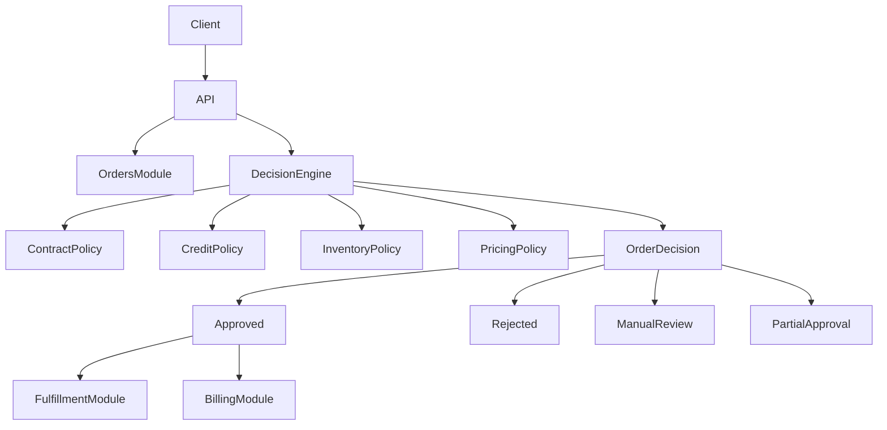

## Documentation

Detailed documentation can be found in the **docs** folder:

- Architecture overview → docs/architecture.md
- Domain model → docs/domain-model.md
- Order decision engine → docs/decision-engine.md


# B2B Order Processing System

## Overview

The **B2B Order Processing System** simulates an enterprise-grade backend platform responsible for processing complex purchase orders between businesses.

Unlike simple CRUD-based systems, this project focuses on **automated business decision-making**, replicating real-world enterprise scenarios such as credit evaluation, contract validation, inventory allocation, and approval workflows.

The system is designed using:

* Domain-Driven Design (DDD)
* Clean Architecture
* Modular Monolith Architecture
* Event-Driven Design

The core objective is to demonstrate how business rules, risk evaluation, and operational workflows can be modeled and executed in a scalable and maintainable backend system

---

# Business Problem

In real-world B2B environments, order processing is far from trivial.

Before an order is accepted, companies must evaluate:

* Contract validity
* Customer credit limits
* Pricing agreements
* Inventory availability across warehouses
* Risk and approval requirements

These processes are often fragmented across multiple systems or performed manually, leading to inefficiencies, delays, and errors.

This project demonstrates how to centralize and automate these decisions through a **domain-driven decision engine**.

---

# Domain Strategy

Following **Domain-Driven Design principles**, the system domain is divided into three types of subdomains.

## Core Subdomain

### Order Decision Engine

The **Order Decision** Engine is the heart of the system.

It evaluates incoming purchase orders using a policy-based decision model, applying multiple business rules:

* Credit Policy
* Contract Policy
* Inventory Policy
* Pricing Policy
* Risk Policy

Each policy produces a decision result:

* Valid / Invalid
* Reason
* Severity

Based on these evaluations, the system determines whether an order should be:

* Approved
* Rejected
* Partially Approved
* Sent for Manual Review
* Escalated for Approval

This engine represents the core competitive advantage of the system.

---

## Supporting Subdomains

These domains support the core business logic:

* Order Management
* Fulfillment (Shipment & Logistics)
* Billing & Invoicing
* Inventory Management

---

## Generic Subdomains

Generic domains represent common technical capabilities that exist in most software systems.

These domains usually do not provide competitive advantage.

Common cross-cutting concerns:

* Authentication
* Logging
* Notifications
* Monitoring

---

# Architecture

The system follows modern architecture principles including:

* Domain-Driven Design (DDD)
* Clean Architecture
* Modular Monolith Architecture
* Separation of Concerns
* Event-Driven Architecture

The application is organized into logical modules representing business capabilities.

---

## Architecture Diagram



---

# High Level Architecture

Client
|
v
API Layer
|
v
Application Layer
|
v
Domain Layer
|
v
Infrastructure
|
v
Database

---

# Modular Monolith Structure

The system is organized using a **Modular Monolith architecture** where business capabilities are implemented as independent modules inside a single application.

```
src
 ├── Api
 │    ├── Controllers
 │    └── Middleware
 │
 ├── Modules
 │
 │   ├── OrderDecisionEngine
 │   │    ├── Domain
 │   │    │     ├── Entities
 │   │    │     ├── ValueObjects
 │   │    │     ├── Policies
 │   │    │     └── Events
 │   │    │
 │   │    ├── Application
 │   │    │     ├── Commands
 │   │    │     ├── Queries
 │   │    │     └── Handlers
 │   │    │
 │   │    └── Infrastructure
 │   │
 │   ├── Orders
 │   ├── Fulfillment
 │   ├── Billing
 │   ├── Inventory
 │
 ├── SharedKernel
 │    ├── Base
 │    ├── Exceptions
 │    └── DomainEvents
 │
 └── Infrastructure
      ├── Persistence
      ├── Messaging
      └── Logging
```

This structure keeps the system modular while maintaining the simplicity of a monolithic deployment.

---

# Core Domain Workflow

The order processing workflow is centered around the **Order Decision Engine**.

Order Submitted
↓
Contract Validation
↓
Credit Evaluation
↓
Inventory Allocation
↓
Pricing Rules
↓
Risk Analysis
↓
Decision

Possible decisions:

* APPROVED
* REJECTED
* PARTIALLY_APPROVED
* MANUAL_REVIEW
* APPROVAL_REQUIRED

---

# Domain Model

Main domain entities include:

### PurchaseOrder

```
PurchaseOrder
 - Id
 - CustomerId
 - OrderLines
 - Currency
 - TotalAmount
 - Status
 - CreatedAt
 - ApprovedAt
 - RejectionReason
```

### OrderLine

```
OrderLine
 - ProductId
 - Quantity
 - UnitPrice
 - Discount
 - Total
```

### Contract

```
Contract
 - ContractId
 - CustomerId
 - ExpirationDate
 - CreditLimit
 - PricingRules
```

### InventoryItem

```
InventoryItem
 - ProductId
 - WarehouseId
 - AvailableQuantity
```

---

###Order Lifecycle

* DRAFT
* SUBMITTED
* UNDER_REVIEW
* APPROVED
* PARTIALLY_APPROVED
* REJECTED
* FULFILLED
* SHIPPED
* INVOICED
* CANCELLED

---

# Domain Events

* OrderSubmittedEvent
* OrderApprovedEvent
* OrderRejectedEvent
* OrderPartiallyApprovedEvent
* CreditLimitExceededEvent
* InventoryReservedEvent
* InventoryUnavailableEvent
* ShipmentCreatedEvent
* InvoiceGeneratedEvent
* InvoiceFailedEvent

---

# Advanced Business Scenarios

This project includes realistic enterprise scenarios:

* Partial order fulfillment
* Backorder handling
* Multi-warehouse inventory allocation
* Credit risk evaluation
* Multi-step approval workflows
* Event-driven failure recovery
* Retry mechanisms for failed processes
* 
---

## Features

- Create and manage B2B purchase orders
- Automated decision engine
- Policy-based validation system
- Contract and pricing validation
- Credit risk management
- Inventory allocation
- Approval workflows
- Event-driven processing

---

# Technology Stack

The project uses the following technologies:

* ASP.NET Core
* C#
* Entity Framework Core
* SQL Server
* Docker
* Swagger / OpenAPI

---

# Running the Project

Clone the repository:

```
git clone https://github.com/your-username/b2b-order-processing-system
```

Navigate to the project folder:

```
cd b2b-order-processing-system
```

Run the API:

```
dotnet run
```

After running the project, open Swagger in your browser to explore the available API endpoints.

---

# Future Improvements

Possible future enhancements include:

* Implementing asynchronous messaging (RabbitMQ or Azure Service Bus)
* Adding event sourcing
* Implementing distributed workflows
* Adding observability (metrics, tracing and monitoring)
* Evolving modules into independent microservices

---

# Purpose of the Project

This project was developed as a **learning and portfolio project** to demonstrate:

* Backend architecture design
* Domain modeling
* Implementation of Domain-Driven Design concepts
* Enterprise backend development using ASP.NET Core


